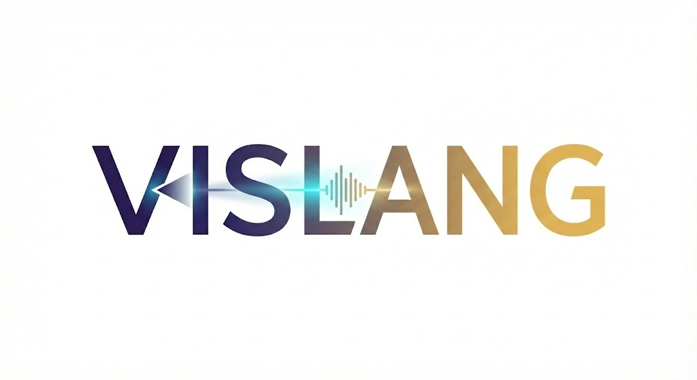
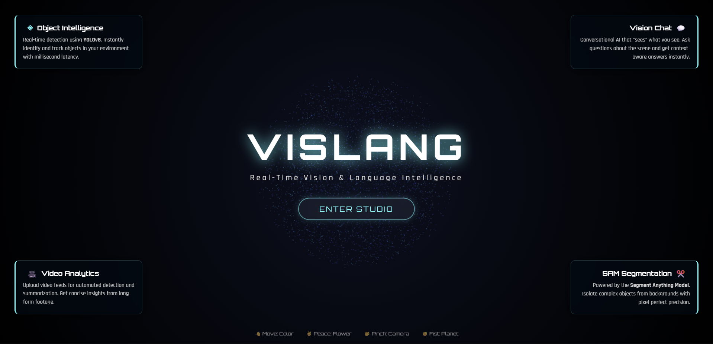
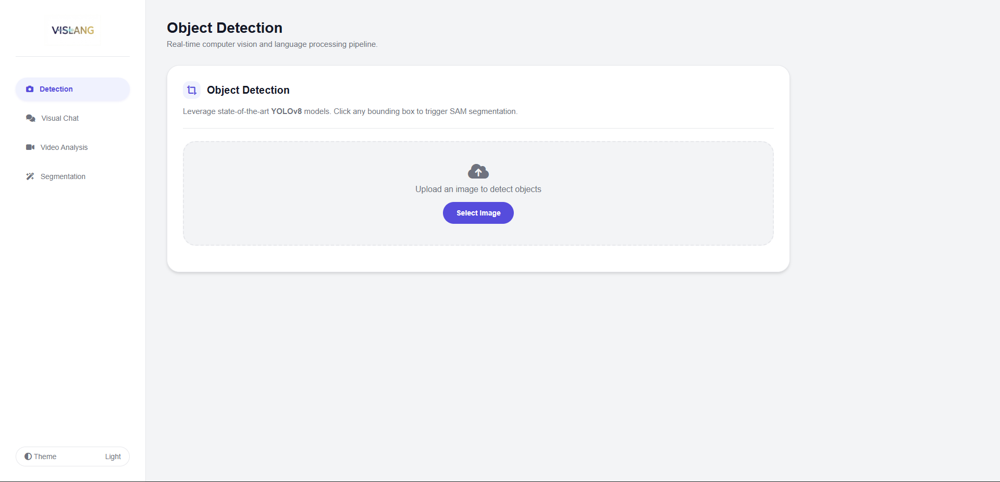
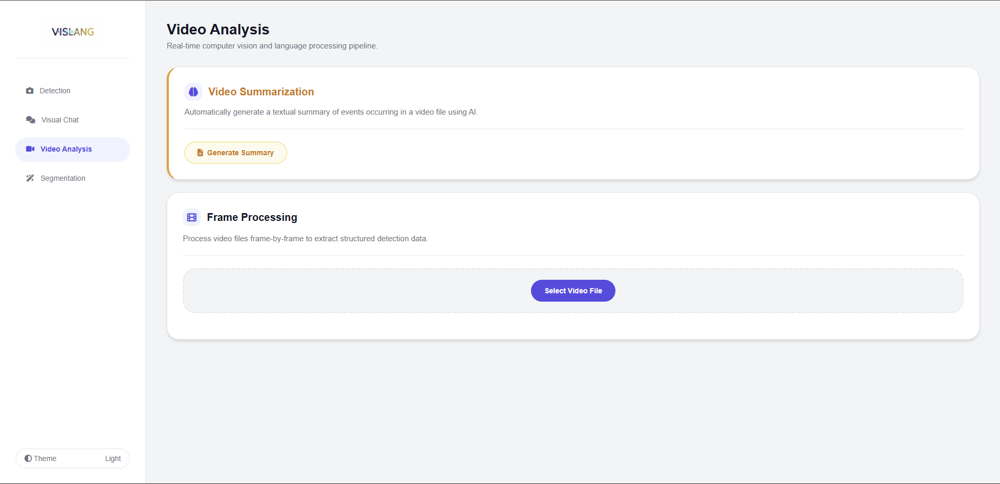

#   
  <br><br> - Real-Time Vision-Language Assistant


<div align="center">

  
  <br><br>
  
  <br><br>
  
  <br><br>
</div>

<br>

**VisLang** is a full-stack, multimodal AI application that combines state-of-the-art Computer Vision models with Large Language Models (LLMs). It provides a unified interface for real-time object detection, interactive segmentation, visual question answering (VQA), and intelligent video summarization.

---

## 🚀 Key Features

### 1. 🔍 Real-Time Object Detection
- **Powered by:** `YOLOv8` (You Only Look Once, v8)
- **Functionality:** Instantly identifies and locates objects within uploaded images.
- **Capabilities:** Draws bounding boxes with class labels and confidence scores in milliseconds. Serves as the entry point for further analysis like segmentation.

### 2. ✂️ Interactive Segmentation (SAM)
- **Powered by:** `SAM` (Segment Anything Model by Meta)
- **Functionality:** Allows users to "cut out" any object from an image with pixel-perfect precision.
- **Interaction Modes:**
  - **Click-to-Segment:** Click on an object (Green point) to instantly mask it.
  - **Box-to-Segment:** Click a YOLO bounding box to automatically segment that specific object.
  - **Outputs:** Generates binary masks, cropped object images, and transparent background PNGs.

### 3. 💬 Visual Chat (VQA)
- **Powered by:** `Ollama` running `LLaVA` or `Moondream`
- **Functionality:** Engage in natural language conversations with your images.
- **Use Case:** Upload a photo and ask, *"What is unusual about this scene?"* or *"Describe the architectural style."* The AI "sees" the image and answers contextually.

### 4. 🎬 Intelligent Video Analysis & Summarization
- **Powered by:** `Moondream` (efficient VLM) & `YOLOv8`
- **Functionality:**
  - **Summarization:** The AI watches a video file and generates a concise text summary of the events (e.g., *"A person walks into the frame and picks up a red bag"*).
  - **Frame Processing:** Analyzes video frame-by-frame to track object occurrences and calculate FPS stats.

---

## 🧠 AI Models Under the Hood

| Model | Role | Why we chose it |
| :--- | :--- | :--- |
| **YOLOv8** (Ultralytics) | Object Detection | Industry standard for real-time speed and accuracy. Lightweight and efficient for edge deployment. |
| **SAM** (Meta AI) | Segmentation | "Zero-shot" capability means it can segment objects it has never seen before without retraining. |
| **Moondream** | Video Summary | An ultra-efficient Vision-Language Model (VLM) designed to run on consumer hardware, perfect for processing many video frames quickly. |
| **LLaVA** | Visual Chat | A powerful multimodal model that offers detailed, ChatGPT-like reasoning for static images. |

---

## 🏗️ Architecture: How It Works

### Frontend to Backend Flow
The application follows a decoupled **Client-Server architecture** containerized with Docker.

1.  **The Frontend (Client):**
    * Built with **HTML5, CSS3, and Vanilla JavaScript**.
    * Served via a lightweight **Node.js** server.
    * **Action:** When a user uploads an image or clicks a button, the JS captures the event and bundles the data (images, prompt points, text) into a `FormData` object.
    * **Communication:** Sends asynchronous `fetch()` requests to the backend API endpoints (e.g., `POST /api/v1/detect`).

2.  **The Backend (Server):**
    * Built with **FastAPI** (Python), chosen for its high performance and native support for asynchronous operations.
    * **Processing:**
        * **Images:** Processed using `Pillow` and `OpenCV` before being fed into PyTorch models.
        * **AI Inference:** The backend loads YOLO and SAM models into memory. For Chat/Summary, it acts as a proxy, forwarding the image data to the **Ollama** instance running on the host machine.
    * **Response:** Returns JSON data (coordinates, text) or media files (generated masks/crops) back to the frontend.

3.  **Docker Integration:**
    * **Containerization:** Both the Frontend and Backend run in separate, isolated Docker containers.
    * **Networking:** They communicate via an internal Docker network. The backend container is configured to "talk" to the host machine (your computer) to access the Ollama API, bypassing standard container isolation via `host.docker.internal`.

---

## 🛠️ Installation & Setup

### Prerequisites
1.  **Docker Desktop** installed and running.
2.  **Ollama** installed on your host machine (Windows/Mac/Linux).
3.  **Pull required AI models:**
    ```bash
    ollama pull moondream
    ollama pull llava
    ```

### Step 1: Configure Ollama (Crucial!)
By default, Ollama only listens to your local computer. To let the Docker container access it, you must expose it.

**For Windows (PowerShell Admin):**
```bash
[Environment]::SetEnvironmentVariable('OLLAMA_HOST', '0.0.0.0', 'User')
```
_After running this, **restart the Ollama app** from the taskbar._

**For Mac/Linux:**
```bash
launchctl setenv OLLAMA_HOST "0.0.0.0
```

    
    # Or add to your shell profile and restart Ollama

### Step 2: Start the Application

Open your terminal in the project root folder (`VISLANG/`) and run:

```bash
docker-compose up --build
```
### Step 3: Access the App

Once the logs show the server is running:

*   Open your browser and go to: **`http://localhost:3000`**
    

### Step 4: Stop the App

To shut everything down cleanly:

docker-compose down

* * *

## 📂 Project Structure

Plaintext

    VISLANG/
    ├── backend/                 # Python FastAPI Server
    │   ├── main.py              # API Entry point
    │   ├── models/              # AI Model logic (YOLO, SAM, Ollama)
    │   ├── outputs/             # Generated masks/crops (Volume mapped)
    │   └── uploads/             # User uploaded files
    ├── frontend/                # Node.js Client
    │   ├── public/              # HTML/CSS/JS Assets
    │   └── server.js            # Express static file server
    ├── docker-compose.yml       # Orchestration config
    └── Dockerfile               # Backend build instructions

